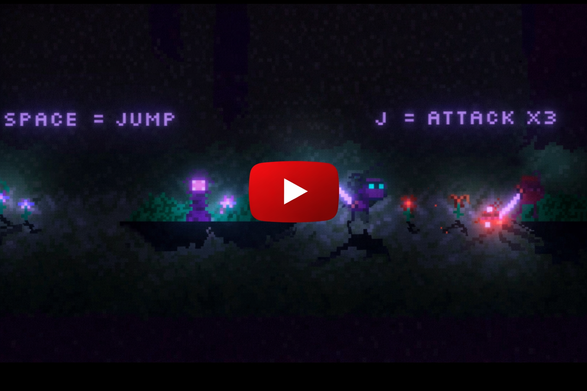
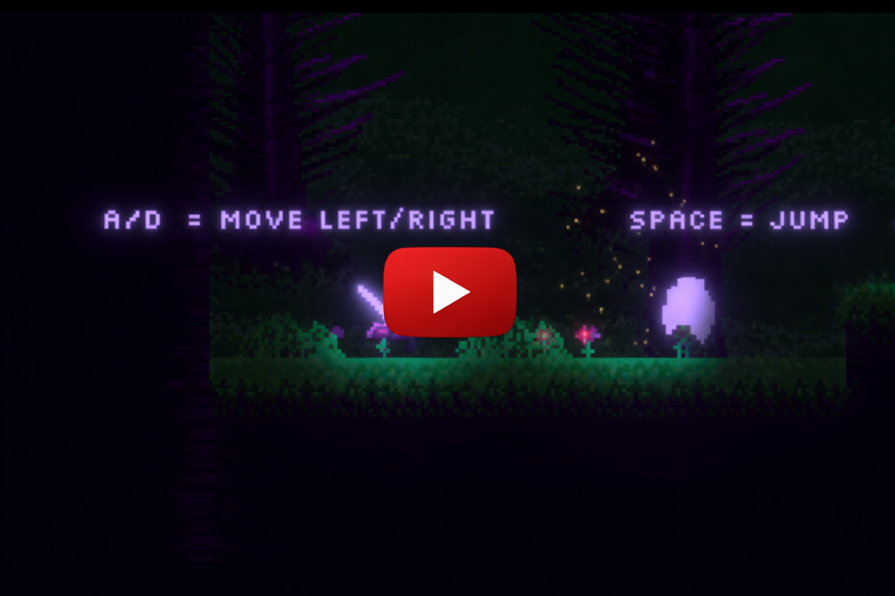
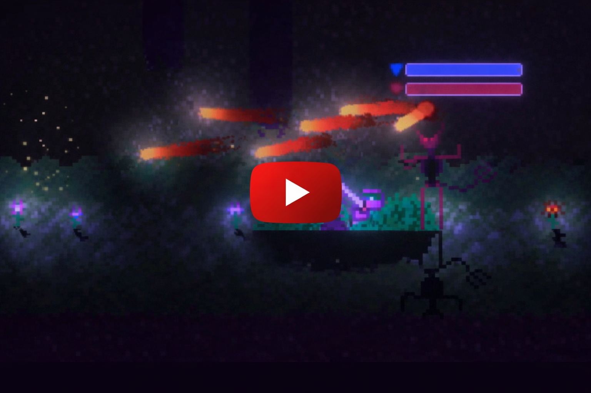
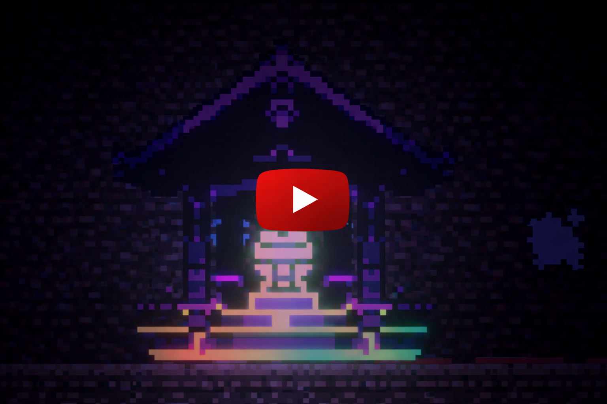
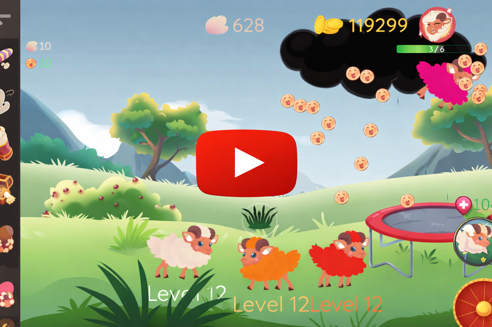
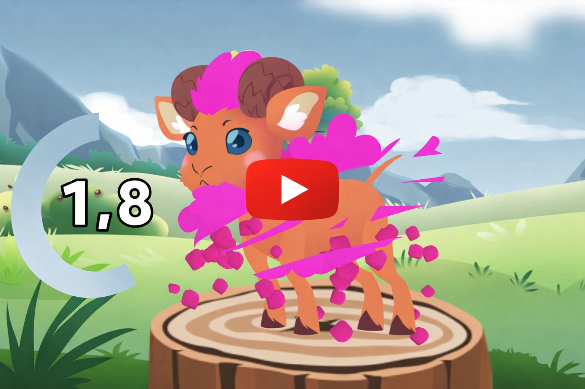

# **Ninja Combat Prototype**

A fast-paced 2D ninja combat prototype built in Unity focused on responsive controls, fluid combo combat, and performance-optimized gameplay systems. The project emphasizes precise combat feedback, enemy behavior variety, and custom visual effects while maintaining smooth performance through deliberate system architecture and optimization strategies.

# Highlights

- Responsive combat system with high combo potential
- Custom hit resolution system for combat interactions
- Enemy AI with varied attack behaviors and patterns
- Custom VFX and shader-based visual effects
- Hybrid player architecture combining a state machine with lightweight custom systems
- Performance optimization through object pooling and distributed AI updates
- Fully custom art and animation created for the project

---

## Tech Stack

**Engine**: Unity Engine

**Programming**: C#

**Graphics**

- Shader Graph
- Unity Particle System
- Post Processing

**Input**: Unity Input System

**Level Design**: Unity Tilemap Editor with autotile setup

**Optimization**

- Object pooling
- Frame-distributed enemy updates
- Hybrid gameplay architecture

---

## Core Systems

### Combat System

Designed a responsive combat system with a minimal control scheme that allows fluid chaining of attacks and high combo potential. Combat interactions are processed through a custom hit resolution system that manages damage, reactions, and combat feedback.

### Player Architecture

Implemented a hybrid gameplay architecture combining a **player state machine with custom lightweight systems**, allowing for flexible combat logic while maintaining strong runtime performance.

### Enemy AI

Created multiple enemy archetypes with unique combat behaviors, including:

- Teleporting enemies requiring precise parry timing
- Ranged enemies throwing shurikens
- Elite enemies with advanced attack patterns and projectile behavior
- AI decision logic determining whether enemies engage directly or maintain distance

# Highlights
### Boss Encounters

Boss enemies feature unique movesets and combat patterns, providing more complex encounters compared to regular enemies.

### Performance Optimization

Several performance techniques were implemented to maintain smooth gameplay:

- Object pooling used for hit effects and visual effects
- Enemy update scheduling where only **one enemy updates per frame**, distributing CPU load while keeping reaction delays unnoticeable
- Optimized gameplay systems designed to reduce runtime overhead

---

## Visual Systems

- Custom VFX created for combat feedback including slash effects and hit effects
    
- Shader Graph effects including:
    
    - Eye glow
    - Sword glow
    - Slash trails
- Particle effects such as blood and environmental effects (fireflies)
- Dynamic lighting effects including lanterns and fireplaces with variable intensity and size
- Parallax background system creating visual depth

---

## Audio

- Designed and implemented original sound effects for combat and gameplay feedback
- Audio cues for attack swings, hits, and death states for both player and enemies
- Sound effects synchronized with animations and combat events

---

## Environment & Level Design

- Tilemap-based level construction using Unity’s Tilemap Editor
- Autotile setup for efficient level building
- Hand-crafted art and animation assets created specifically for the project

---

## Input & Controls

- Implemented using Unity’s modern **Input System**
- Input actions mapped to gameplay commands for flexible control configuration
- Playtested with external players to validate responsiveness and usability

---

## Showcase

- Playtested by multiple players for gameplay feedback and balancing
- Demonstrated during a **Unity SGA showcase**, where the project received positive feedback from Unity developers
---
# **Sheep Breeding Game with Procedural Mutations and Shader-Based Wool System**

A casual physics-driven sheep game built in Unity featuring interactive gameplay mechanics, shader-based wool shaving, and live-service progression systems. The project combines physics interactions, backend services, and engagement mechanics such as breeding mutations, daily rewards, and timed gameplay events.

## Highlights

- Physics-based sheep interaction and throwing mechanics
- Custom cutout shader enabling a dynamic wool shaving effect
- Sheep breeding system with randomized color and stat mutations
- Live-ops mechanics including daily rewards and spin-the-wheel systems
- Timed wolf encounter gameplay events
- Online leaderboard integration
- Backend player account, login, and data persistence systems
---

## Tech Stack

**Engine** :Unity Engine
**Programming**: C#
**Backend Services**: PlayFab (player accounts, login, data persistence, daily rewards)
**Online Systems**: JavaScript scoreboard integration

**Graphics**:

- Custom Cutout Shader
- Shader Graph
- Parallax background system

**Monetization**: In-game advertisements

**Blockchain**

- NFT asset integration
- Crypto token system

---

## Core Systems

### Physics Gameplay System

Sheep interactions are physics-driven, allowing players to grab and throw sheep dynamically for playful and responsive gameplay.

### Breeding & Mutation System

A breeding system generates sheep with randomized **colors and stat variations**, creating unique mutations each time sheep are bred. This introduces progression and collectible gameplay elements.

### Wool Shaving Shader

A custom cutout shader enables a shaving mechanic where wool can be removed to reveal the underlying sheep model. This was implemented using Shader Graph and integrated directly into gameplay interactions.

### Backend & Player Systems

Implemented backend services using **PlayFab**, including:

- Player account creation and login
- Player data persistence
- Daily login reward system

### Progression & Reward Systems

Live-service engagement systems including:

- Daily login rewards
- Spin-the-wheel randomized reward mechanic
- Online leaderboard tracking player scores

### Timed Event System

Wolf encounter events introduce dynamic gameplay challenges where players must react quickly to protect their sheep.

### Monetization

Integrated in-game advertisements into the gameplay loop.

---

## Visual Systems

- Parallax background system creating environmental depth
- Shader-driven wool shaving mechanic
- Physics-driven sheep animations and interactions

---
# METi GO

METi GO is an endless runner built in Unity where players guide METi through a procedurally varied city while avoiding obstacles, collecting coins, and unlocking cosmetics. The game features platform leaderboards, seasonal content, achievement-based progression, and multiple gameplay systems designed to maintain replayability.

<iframe width="560" height="315" 
src="https://www.youtube.com/watch?v=5BqLuG9rP6Q"
title="YouTube video player"
frameborder="0"
allowfullscreen></iframe>

## Highlights

- Endless runner gameplay with obstacle avoidance and coin collection
- Platform leaderboards for both iOS and Android
- Achievement system unlocking exclusive cosmetics
- Seasonal content including winter and Halloween themed items
- Dynamic city variations and environmental changes
- RNG-based reward systems during gameplay
- Mini-game mechanics integrated into the main run loop

---

## Tech Stack

**Engine**: Unity Engine

**Programming**: C#

**Platform Services**

- Google Play Games Services (Android)
- Apple Game Center (iOS)

**Online Systems**

- Cross-platform leaderboards
- Achievement tracking

**Graphics**

- Dynamic environment variations
- Seasonal map changes

---

## Core Systems

### Endless Runner Gameplay

Players control METi as he runs through a city environment, avoiding enemies and obstacles while collecting coins and progressing through increasingly challenging sections.

### Reward & Progression System

Players earn points and coins during runs which can be used to unlock cosmetics and customization items. Some achievements unlock exclusive skins with unique visual effects.

### Achievement System

The game includes a range of achievements integrated through platform services. Certain difficult achievements unlock rare cosmetic rewards.

### Seasonal Content System

Seasonal events introduce limited-time cosmetics and environmental changes including:

- Halloween-themed items available only during the Halloween season
- Winter-themed cosmetics and map variations
- Dynamic seasonal environment transitions

### Mini-Game Event

During a run, players may encounter a mini-game where three doors appear. The correct door is indicated at the top of the screen, and players must react quickly to choose the correct path.

<iframe width="560" height="315" 
src="https://youtu.be/zKx95wicUMA?t=187"
title="YouTube video player"
frameborder="0"
allowfullscreen></iframe>
### Power-Up System

Multiple gameplay power-ups can be triggered during runs:

- **Flight Mode**  
    After filling a progress bar through successful gameplay actions, METi temporarily gains the ability to fly and becomes invulnerable.
    
- **Temporary Shield**  
    RNG reward boxes can grant a shield that protects the player from collisions.
    
- **Bonus Rewards**  
    RNG reward boxes may also grant score boosts or additional virtual currency.
    

### Procedural Environment Variations

The city environment features randomized layout variations during runs to maintain replayability and prevent repetitive gameplay.

---

## Visual Systems

- Stylized city environment with randomized layout variations
- Seasonal visual transitions including winter environments
- Mars-themed skybox with a red sky reflecting METi’s origin

<iframe width="560" height="315" 
src="https://youtu.be/-DY3GA-T9Xc?t=100"
title="YouTube video player"
frameborder="0"
allowfullscreen></iframe>

---

## Platform Integration

- Integrated Google Play Games Services for Android
- Integrated Apple Game Center for iOS
- Cross-platform leaderboards
- Platform achievement systems
---

## Gameplay Features

- Coin collection during runs
- Cosmetic unlock system
- Achievement-based rewards
- Seasonal exclusive items
- Randomized power-up boxes
- Mini-game encounters within runs

# Sarma Clicker

Sarma Clicker is an incremental idle game inspired by cookie-clicker mechanics where players gather countries to help consume increasingly massive quantities of sarma. The project features a custom high-performance number system capable of representing extremely large values while remaining efficient and readable across both mobile and desktop platforms.

<iframe width="560" height="315" 
src="https://youtu.be/VwKqbq2yPcg"
title="YouTube video player"
frameborder="0"
allowfullscreen></iframe>

## Highlights

- Custom optimized infinite number system designed for incremental games
- Idle gameplay loop inspired by cookie-clicker mechanics
- Upgrade system where countries automatically generate sarma consumption
- Custom suffix-based number formatting (K, M, B, etc.)
- Custom music, particle effects, and pixel art

---

## Tech Stack

**Engine**: Unity Engine

**Programming**: C#

**Graphics**

- Custom pixel art
- Unity Particle System

**Audio**

- Custom music implementation

**Gameplay Systems**

- Idle progression system
- Large number handling system
---

## Core Systems

### Custom Infinite Number System

Developed a **list-based large number implementation** designed for incremental games where values quickly exceed traditional numeric limits.

Key characteristics:

- Efficient representation of extremely large numbers
- Designed for performance on both **mobile and PC platforms**
- Easy formatting and editing for gameplay systems
- Customizable suffix system allowing developers to define number formats such as:

K  – Thousand  
M  – Million  
B  – Billion  
T  – Trillion

(infinite number of suffixes allowed)

The system enables clear display of massive values while maintaining full developer control over formatting and arithmetic operations.

---

### Idle Progression System

The game follows a classic incremental gameplay loop:

1. Players consume sarma manually to gain currency
2. Currency is used to purchase countries
3. Countries automatically generate sarma consumption over time
4. Increasing upgrades accelerate progression toward larger numbers

This system allows players to gradually scale from small values to extremely large numbers through automated gameplay systems.

---

### Upgrade System

Countries act as upgrades that:

- Automatically generate sarma consumption
- Increase resource generation rates
- Allow exponential progression typical of idle games

---

## Visual & Audio Systems

- Custom pixel art created for the game's visual identity
- Particle effects used to reinforce gameplay feedback
- Custom music integrated to enhance the gameplay experience

---

## Gameplay Theme

Instead of traditional cookie-clicker mechanics, the game uses **sarma as the central resource**, creating a humorous and culturally themed twist on the incremental genre.

Players gather countries to help consume increasingly massive quantities of sarma, pushing the limits of the custom number system.

---